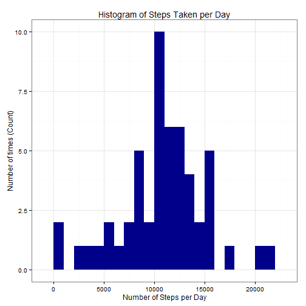
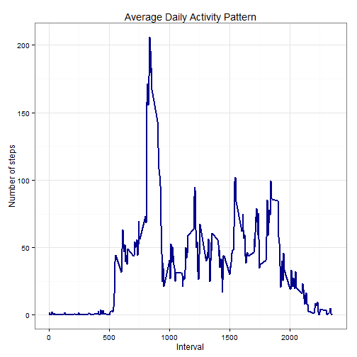
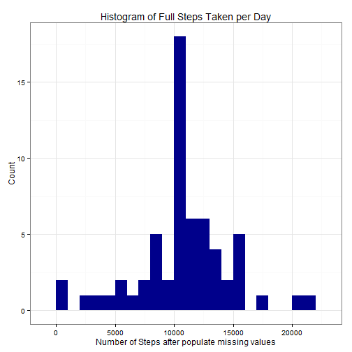
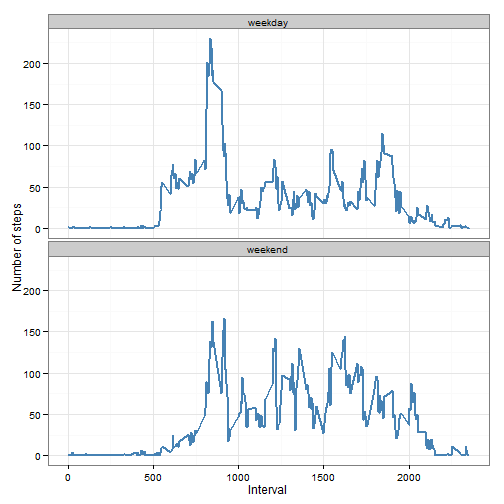

Reproducible Research: Peer Assessment 1
========================================
---
> Created by: **Marcelo Gomes Marques** - At: **05/18/2014**  
> Created with R x64 3.1.0 Patched on Windows 7 64 bits SO and use data.table library  

---


This document presents the results of the Reproducible Research's Peer Assessment 1 in a report using **a single R markdown document** that can be processed by **knitr** and be transformed into an HTML file.

Throughout this report you can always find the code that I used to generate my output presents here. When writing code chunks in the R markdown document, **always use echo = TRUE** so that someone else will be able to read the code. This assignment will be evaluated via peer assessment so <u>it's essential that my peer evaluators be able to review my code and my analysis together.</u>.

First, we set echo equal a **TRUE** and results equal a **'hold'** as global options for this document. 

```r
opts_chunk$set(echo = TRUE, results = "hold")
```


## Loading and preprocessing the data
This assignment makes use of data from a personal activity monitoring device. This device collects data at 5 minute intervals through out the day. The data consists of two months of data from an anonymous individual collected during the months of October and November, 2012 and include the number of steps taken in 5 minute intervals each day.

This assignment instructions request to show any code that is needed to loading and preprocessing the data, like to:

1. Load the data (i.e. > <font color='red'>read.csv()</font>)  
2. Process/transform the data (if necessary) into a format suitable for your analysis

In summary, I proceed with:

1. Initiate with functions definitions and calls libraries
2. Check if the file source is on expected, IE, the uncompressed file of activities is on the directory of this assessment  
        2.1. Check if the zip source file is present  
                2.1.1. uncompressed the file  
                2.1.2. If not the data file is downloaded and uncompressed  
3. The data is read as a data variable type data frame.
4. The interval column is converted to factor type.
5. The date column is converted to Date type.
6. The data is examined by using summary and str well formatted on this document.

### Function definitions and load libraries code segment

First we define a function to check if the files exists in the path defined by file_path. If don't exists stops execution of the current expression, and executes an error action


```r
check_file_exist <- function(file_path) {
    if (!file.exists(file_path)) 
        stop("The ", file_path, " not found!") else TRUE
}
```

Next, we use data set and data_dir to define the file_path, call the check_file_exist function to check, if the file exist send a message to user for waiting the load of file. Finally returned with data set load to data variable.

```r
load_data <- function(data_dir, fileURL, fileSource) {
    # Dataset check and load
    
    source_path <- paste(data_dir, "/", fileSource, sep = "")
    txt_file <- paste(data_dir, "/", "activity.csv", sep = "")
    
    if (!file.exists(txt_file)) {
        if (!file.exists(source_path)) {
            message(paste("Please Wait! Load", fileURL, "..."))
            download.file(fileURL, destfile = source_path)
        } else {
            message(paste("Please Wait! Unzip", source_path, " file..."))
            unzip(source_path, exdir = data_dir)
        }
    }
    message(paste("Please Wait! Load", txt_file, " to dataset..."))
    data <- read.csv(txt_file, header = TRUE, na.strings = "NA", colClasses = c("numeric", 
        "character", "numeric"))
    data$interval <- factor(data$interval)
    data$date <- as.Date(data$date, format = "%Y-%m-%d")
    data
    
}
```


### Load data.table, xtable and ggplot2 libraries

```r

library(data.table)
library(xtable)
library(ggplot2)  # we shall use ggplot2 for plotting figures
```

End Function definitions and load libraries code segment

***

### Assign the directory that all data set was unzip and confirm its exists
Maybe you need to change this data_dir variable to yours peeress directory, because the line code that ask you inform where the data directory is find, use readline function, not function at markdown documents.


```r
data_dir <- "C:/Users/Marcelo/RepData_PeerAssessment1"
```


Check if the "./RepData_PeerAssessment1" directory exists, if doesn't ask to user the path of his data directory. If user inform a invalid directory path stops execution of the current expression and executes an error action.

```r
if (!file.exists(data_dir)) {
    # data_dir <- readline(prompt = 'Please, inform your data directory path: ')
    data_dir <- "./RepData_PeerAssessment1"  ## simulate a valid data entry
    if (!file.exists(data_dir)) {
        stop("You inform a invalid directory path")
    }
}
```


Here its rely the point at the all data load and preparation is call and run to assign the tidy data a data frame variable named *tidy*.
Here, we initiate the main variables and run data load and preparation process for the activate data.

```r

fileURL <- "https://d396qusza40orc.cloudfront.net/repdata%2Fdata%2Factivity.zip"
fileSource <- "activity.zip"
source_path <- paste(data_dir, "/", fileSource, sep = "")
txt_file <- paste(data_dir, "/", "activity.csv", sep = "")

if (!file.exists(txt_file)) {
    if (!file.exists(source_path)) {
        message(paste("Please Wait! Load", fileURL, "..."))
        download.file(fileURL, destfile = source_path)
    } else {
        message(paste("Please Wait! Unzip", source_path, " file..."))
        unzip(source_path, exdir = data_dir)
    }
}
message(paste("Please Wait! Load", txt_file, " to dataset..."))
```

```
## Please Wait! Load C:/Users/Marcelo/RepData_PeerAssessment1/activity.csv  to dataset...
```

```r
tidy <- read.csv(txt_file, header = TRUE, sep = ",", colClasses = c("numeric", 
    "character", "numeric"))
tidy$interval <- factor(tidy$interval)
tidy$date <- as.Date(tidy$date, format = "%Y-%m-%d")
```


Now, we can proceed with the data pre-examination of its str and ...

```r
str(tidy)
```

```
## 'data.frame':	17568 obs. of  3 variables:
##  $ steps   : num  NA NA NA NA NA NA NA NA NA NA ...
##  $ date    : Date, format: "2012-10-01" "2012-10-01" ...
##  $ interval: Factor w/ 288 levels "0","5","10","15",..: 1 2 3 4 5 6 7 8 9 10 ...
```

...summary methods.

```r
xt <- xtable(summary(tidy))
print(xt, type = "html")
```

<!-- html table generated in R 3.1.0 by xtable 1.7-3 package -->
<!-- Sun May 18 22:22:59 2014 -->
<TABLE border=1>
<TR> <TH>  </TH> <TH>     steps </TH> <TH>      date </TH> <TH>    interval </TH>  </TR>
  <TR> <TD align="right"> 1 </TD> <TD> Min.   :  0.0   </TD> <TD> Min.   :2012-10-01   </TD> <TD> 0      :   61   </TD> </TR>
  <TR> <TD align="right"> 2 </TD> <TD> 1st Qu.:  0.0   </TD> <TD> 1st Qu.:2012-10-16   </TD> <TD> 5      :   61   </TD> </TR>
  <TR> <TD align="right"> 3 </TD> <TD> Median :  0.0   </TD> <TD> Median :2012-10-31   </TD> <TD> 10     :   61   </TD> </TR>
  <TR> <TD align="right"> 4 </TD> <TD> Mean   : 37.4   </TD> <TD> Mean   :2012-10-31   </TD> <TD> 15     :   61   </TD> </TR>
  <TR> <TD align="right"> 5 </TD> <TD> 3rd Qu.: 12.0   </TD> <TD> 3rd Qu.:2012-11-15   </TD> <TD> 20     :   61   </TD> </TR>
  <TR> <TD align="right"> 6 </TD> <TD> Max.   :806.0   </TD> <TD> Max.   :2012-11-30   </TD> <TD> 25     :   61   </TD> </TR>
  <TR> <TD align="right"> 7 </TD> <TD> NA's   :2304   </TD> <TD>  </TD> <TD> (Other):17202   </TD> </TR>
   </TABLE>


## What is mean total number of steps taken per day?

For this part of the assignment, we can ignore the missing values in the data set.

We initiate with a pre-calculation of steps aggregation by day:

```r
steps_taken_per_day <- aggregate(steps ~ date, tidy, sum)
colnames(steps_taken_per_day) <- c("date", "steps")
```

1. At following, we present a histogram of the total number of steps taken each day, plotted with a bin interval of 1000 steps per Day. 

```r
ggplot(steps_taken_per_day, aes(x = steps)) + geom_histogram(fill = "darkblue", 
    binwidth = 1000) + labs(title = "Histogram of Steps Taken per Day", x = "Number of Steps per Day", 
    y = "Number of times (Count)") + theme_bw()
```

 

2. Finally, we presents the mean and median of total number of steps taken per day:  


```r
mean_steps = round(mean(steps_taken_per_day$steps, na.rm = TRUE), 2)
median_steps = round(median(steps_taken_per_day$steps, na.rm = TRUE), 2)
```

The Mean is **10766.19** and 
the Median is **10765**

## What is the average daily activity pattern?

First, we calculate the aggregation of steps by intervals of 5-minutes, coerce the interval to integer and give names for colons of the result of this aggregation.

```r
steps_per_interval <- aggregate(tidy$steps, by = list(interval = tidy$interval), 
    FUN = mean, na.rm = TRUE)
# convert to integers for plotting
steps_per_interval$interval <- as.integer(levels(steps_per_interval$interval)[steps_per_interval$interval])
colnames(steps_per_interval) <- c("interval", "steps")
```

Then, we present below a plot with the time series of the average number of steps taken (averaged across all days) versus the 5-minute intervals:

```r
ggplot(steps_per_interval, aes(x = interval, y = steps)) + geom_line(color = "darkblue", 
    size = 1) + labs(title = "Average Daily Activity Pattern", x = "Interval", 
    y = "Number of steps") + theme_bw() + theme(legend.position = "bottom")
```

 

Now, we find the 5-minute interval with the containing the maximum number of steps:

```r
max_step_interval <- steps_per_interval[which.max(steps_per_interval$steps), 
    ]$interval
```

The **835<sup>th</sup> 5-minute interval**  containing the maximum number of steps.

## Imputing missing values

To populate missing values, we choose to replace them with the mean value at the same interval across days. In most of the cases the median is a better centrality measure than mean, but in our case the total median is not much far away from total mean, and probably we can make the mean and median meets.


```r
fill_na <- function(data, defaults) {
    na_indices <- which(is.na(data$steps))
    na_replacements <- unlist(lapply(na_indices, FUN = function(idx) {
        interval = data[idx, ]$interval
        defaults[defaults$interval == interval, ]$steps
    }))
    fill_steps <- data$steps
    fill_steps[na_indices] <- na_replacements
    fill_steps
}

data_fill <- data.frame(steps = fill_na(tidy, steps_per_interval), date = tidy$date, 
    interval = tidy$interval)
```


Here is a histogram of the daily total number of steps taken, plotted with a bin interval of 1000 steps, after the populate missing values.


```r

full_steps_per_day <- aggregate(steps ~ date, data_fill, sum)
colnames(full_steps_per_day) <- c("date", "steps")

ggplot(full_steps_per_day, aes(x = steps)) + geom_histogram(fill = "darkblue", 
    binwidth = 1000) + labs(title = "Histogram of Full Steps Taken per Day", 
    x = "Number of Steps after populate missing values", y = "Count") + theme_bw()
```

 

As you can see, comparing with the calculations done in the first section of this document, we observe that while the mean value remains unchanged, the median value has shifted and virtual matches to the mean.


```r
full_mean_steps = round(mean(full_steps_per_day$steps), 2)
full_median_steps = round(median(full_steps_per_day$steps), 2)
```

* Mean after populate missing values is **10766.19**  
* Median populate missing values is **10766.19**

* Mean before populate missing values is **10766.19**  
* Median before missing values is **10765**

## Are there differences in activity patterns between weekdays and weekends?
We do this comparison with the table with filled-in missing values.

1. Augment the table with a column that indicates the day of the week
2. Subset the table into two parts - weekends (Saturday and Sunday) and weekdays (Monday through Friday).
3. Tabulate the average steps per interval for each data set.
4. Plot the two data sets side by side for comparison.


```r
weekdays_steps <- function(data) {
    weekdays_steps <- aggregate(data$steps, by = list(interval = data$interval), 
        FUN = mean, na.rm = T)
    # convert to integers for plotting
    weekdays_steps$interval <- as.integer(levels(weekdays_steps$interval)[weekdays_steps$interval])
    colnames(weekdays_steps) <- c("interval", "steps")
    weekdays_steps
}

data_by_weekdays <- function(data) {
    data$weekday <- as.factor(weekdays(data$date))  # weekdays in portuguese
    weekend_data <- subset(data, weekday %in% c("sábado", "domingo"))
    weekday_data <- subset(data, !weekday %in% c("sábado", "domingo"))
    
    weekend_steps <- weekdays_steps(weekend_data)
    weekday_steps <- weekdays_steps(weekday_data)
    
    weekend_steps$dayofweek <- rep("weekend", nrow(weekend_steps))
    weekday_steps$dayofweek <- rep("weekday", nrow(weekday_steps))
    
    data_by_weekdays <- rbind(weekend_steps, weekday_steps)
    data_by_weekdays$dayofweek <- as.factor(data_by_weekdays$dayofweek)
    data_by_weekdays
}

data_weekdays <- data_by_weekdays(data_fill)
```


Below you can see the panel plot comparing the average number of steps taken per 5-minute interval across weekdays and weekends:

```r
ggplot(data_weekdays, aes(x = interval, y = steps)) + geom_line(color = "steelblue", 
    size = 1) + facet_wrap(~dayofweek, nrow = 2, ncol = 1) + labs(x = "Interval", 
    y = "Number of steps") + theme_bw()
```

 


### Conclusion:

We can see at the graph above that activity on the weekday has the greatest peak from all steps intervals. But, we can see too that weekends activities has more peaks over a hundred than weekday. This could be due to the fact that activities on weekdays mostly follow a work related routine, where we find some more intensity activity in little a free time that the employ can made some sport. In the other hand, at weekend we can see better distribution of effort along the time.
